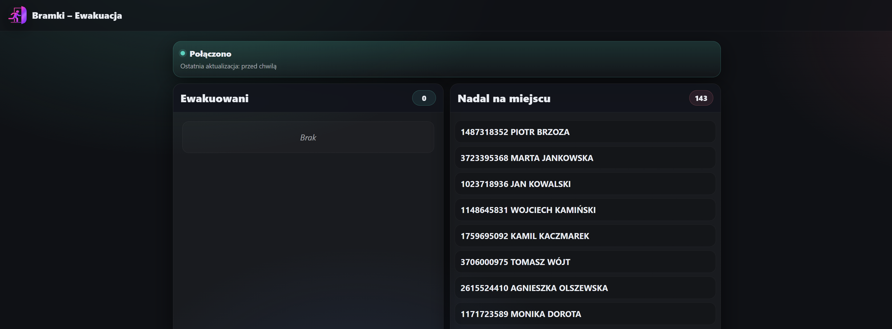
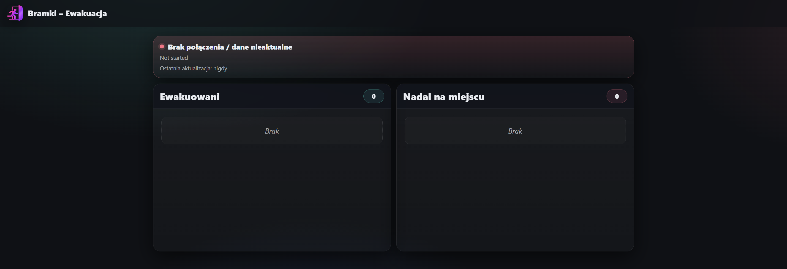

# Bramki Evacuation Dashboard

A **Blazor (Interactive Server)** dashboard that continuously reads attendance-zone occupancy from an external API and presents a clear evacuation view:

- **Ewakuowani** (people currently in the muster/evacuation zone)
- **Nadal na miejscu** (people still onsite and not yet evacuated)

Designed for real-time visibility during drills/incidents, with a simple two-column layout and clear connection status.

---

## Key Features

- Live occupancy dashboard (auto-refresh)
- Two lists with counts:
  - ✅ Ewakuowani
  - ❗ Nadal na miejscu
- Connection / health banner:
  - shows stale data status
  - shows last successful refresh (“przed chwilą”, “10s temu”, etc.)
  - shows last error message when disconnected
- Background polling service with safe failure behavior:
  - keeps last known snapshot on errors
  - marks data as stale until next successful update
- WCF client integration (Connected Services)
- Session/token management with keep-alive and automatic reconnect
- Person display name normalization and formatting

---

## Tech Stack

- .NET 8
- ASP.NET Core
- Blazor (Razor Components, Interactive Server)
- Hosted services (`BackgroundService`)
- WCF Connected Services (`BasicHttpBinding`)
- Custom dashboard styling (`wwwroot/app.css`)

---

## UI Overview

The home page (`/`) shows:

- Status panel (connected vs stale)
- Two cards:
  - Ewakuowani (muster zone occupants)
  - Nadal na miejscu (onsite occupants not present in muster zone)

---

## How It Works

### Data flow

1. `ApiSessionManager` establishes an authenticated session and maintains a session token.
2. `EvacPoller` runs on a periodic timer (default 1000 ms):
   - fetches occupancy list for `OnsiteZoneId`
   - fetches occupancy list for `MusterZoneId`
3. The poller computes:
   - `Evacuated` = people in the muster zone
   - `StillOnsite` = onsite minus evacuated
4. Results are stored in `EvacStore` as an `EvacSnapshot`.
5. The Blazor UI subscribes to `EvacStore.Changed` and updates instantly.

### Resilience

- If a poll fails, the last snapshot is preserved and marked as `IsStale = true`.
- If the API token is invalid/expired, `IntegrationFacade` retries after forcing a token refresh.
- `ApiSessionManager` runs keep-alive checks and reconnects automatically when required.

---

## Project Structure

    Bramki_Evacuation/
     ├── Components/
     │    ├── App.razor
     │    ├── Routes.razor
     │    ├── _Imports.razor
     │    ├── Layout/
     │    │    ├── MainLayout.razor
     │    │    └── MainLayout.razor.css
     │    └── Pages/
     │         └── Home.razor
     ├── Dashboard/
     │    ├── EvacSnapshot.cs
     │    └── EvacStore.cs
     ├── Services/
     │    ├── DashboardOptions.cs
     │    └── EvacPoller.cs
     ├── Wcf/
     │    ├── ApiClientFactory.cs
     │    ├── ApiOptions.cs
     │    ├── ApiSessionManager.cs
     │    └── IntegrationFacade.cs
     ├── Connected Services/
     │    ├── Bramki_Evacuation.SessionManagement/
     │    └── Bramki_Evacuation.Integration/
     ├── wwwroot/
     │    ├── app.css
     │    ├── favicon.png
     │    └── icons/evac.png
     ├── appsettings.json
     ├── appsettings.Development.json
     └── Program.cs

---

## Configuration

Settings are read from `appsettings.json`.

### API

    Api:
      BaseUrl: http://API_Server_Address
      ServiceAccount:
        Login: API_Login
        Password: API_Password
      TimeoutSeconds: 20
      KeepAliveSeconds: 30

### Dashboard

    Dashboard:
      OnsiteZoneId: 1
      MusterZoneId: 2
      RefreshMs: 1000

Meaning:
- `OnsiteZoneId` – attendance zone representing “onsite”
- `MusterZoneId` – attendance zone representing the muster/evacuation point
- `RefreshMs` – polling interval (min 250 ms enforced)

---

## Running

### Requirements

- .NET 8 SDK
- Network access to the API server
- Connected Services configured against your API WSDLs

### Run (development)

    dotnet run

Then open:

    https://localhost:5001/

---

## Connected Services Notes

This project uses WCF Connected Services generated from API WSDL endpoints.

To recreate them in a new environment, re-add service references using the real endpoints (so bindings and generated types match the server).

Example WSDL inputs:
- `.../Integration?wsdl`
- `.../SessionManagement?wsdl`

---

## Future Improvements

- Add search/filter in UI for large lists
- Add export (CSV/PDF) of current snapshot
- Add snapshot history (“drill mode”)
- Add authentication in front of the dashboard (if exposed beyond a trusted network)
- Move zone IDs / endpoints into an admin configuration page

---

## Screenshots

